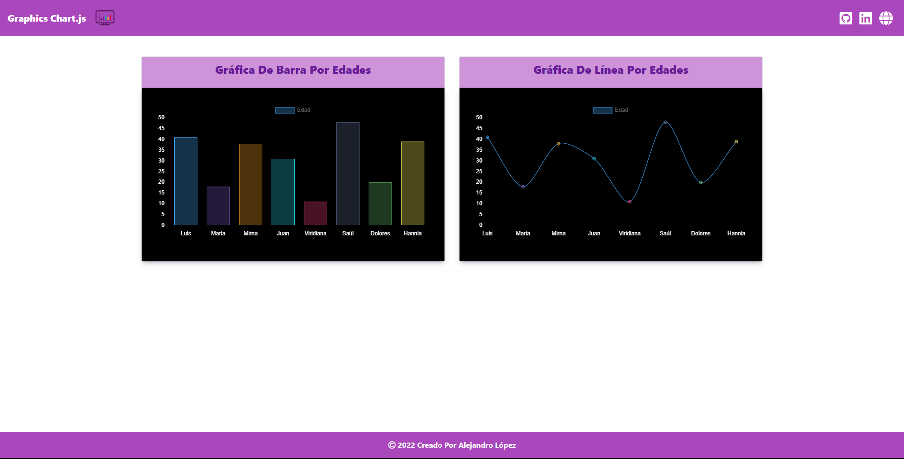

# <h1 align="center" style="color: #80cbc4;"> Graphics Chart.js 👨🏻‍💻 </h1> 
  

` Chart.js`  is a free, open source JavaScript library for data visualization, supporting 8 chart types: 
- Bar.
- Line.
- Area. 
- Pie. 
- Bubble.
- Radar. 
- Polar.
- Scatter.

  

## 
 Requirements 

- [HTML5](https://developer.mozilla.org/es/docs/Web/HTML) 
- [CSS3](https://developer.mozilla.org/es/docs/Web/CSS)
- [JavaScript](https://developer.mozilla.org/es/docs/Web/JavaScript)

## 
 References 

- [Chart.js](https://www.chartjs.org/)

  

## 
 Screenshot Project 💻 

🔶 [Project Website](https://alejandro-190107.github.io/Chart.js/)

